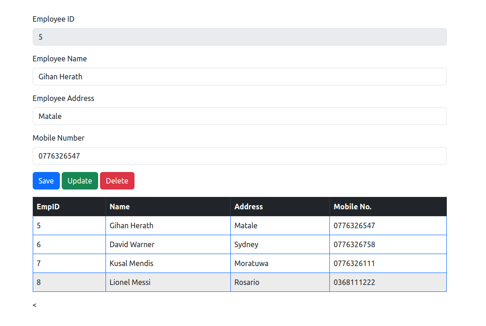

<!-- ABOUT THE PROJECT -->
# <b>Employee Management System</b>

Developed a complete full stack CRUD project using Java, Springboot, HTML, CSS, JavaScript, Bootstrap and MySQL
 

## Built with using

* HTML5 
* CSS3 
* JavaScript 
* Java 
* Spring Boot
* Bootstrap 
* MySQL 

<!-- CONTACT -->
## Contact

Gihan Herath - [@LinkedIn](https://www.linkedin.com/in/gihanpherath/)

Project Link: [Check the repository on GitHub](https://github.com/gihan-herath/Portfolio-Webpage)

<!-- MARKDOWN LINKS & IMAGES -->
<!-- https://www.markdownguide.org/basic-syntax/#reference-style-links -->
